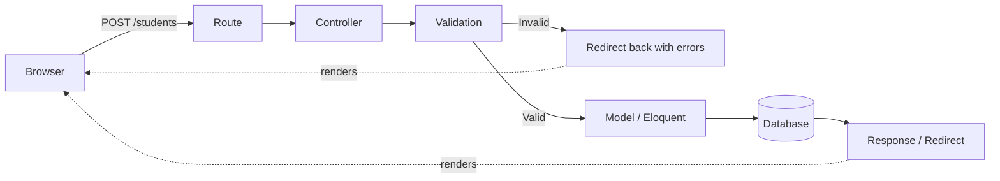
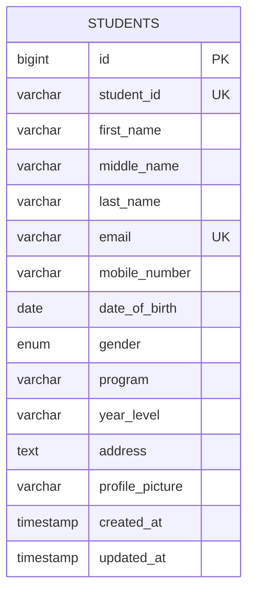
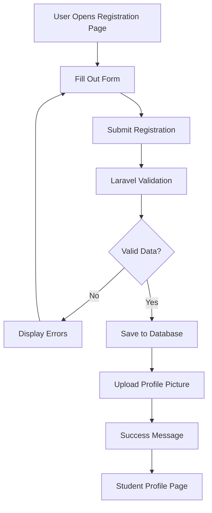
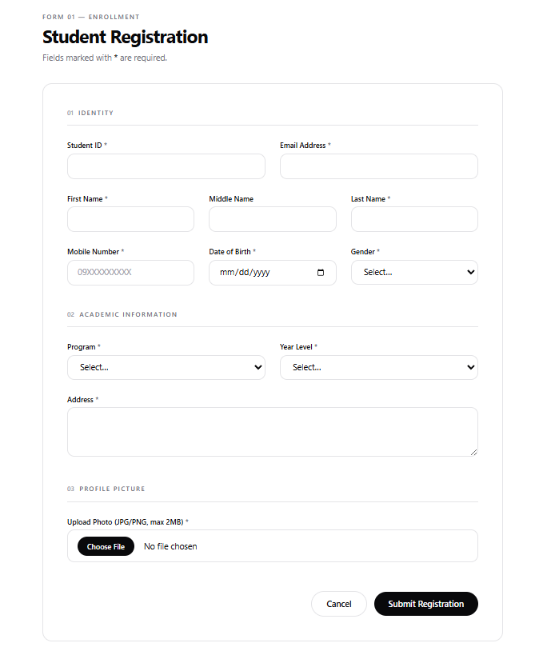
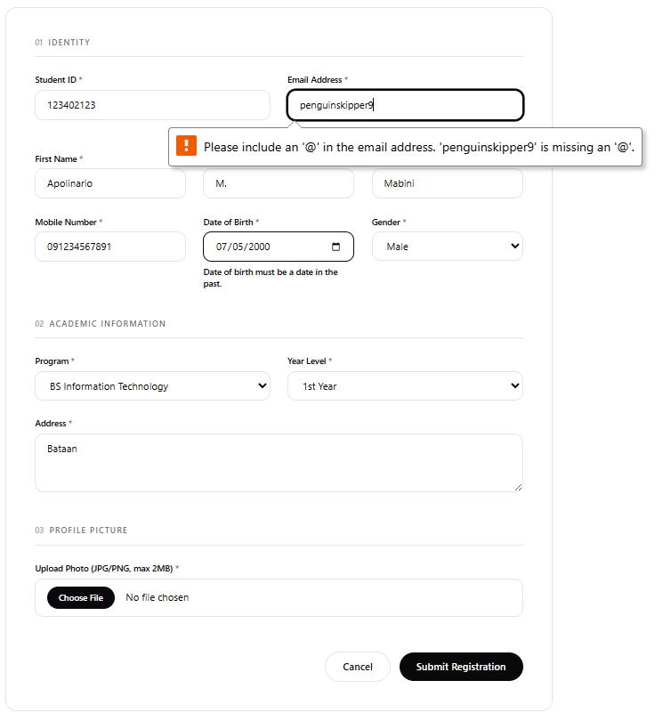
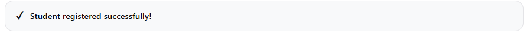
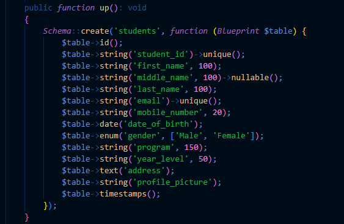
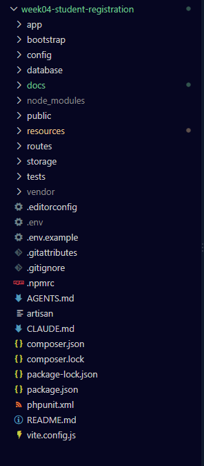
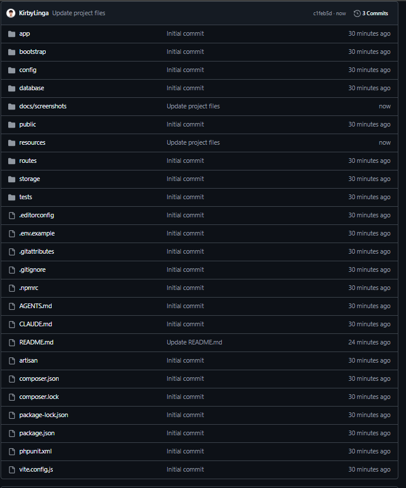

# Student Registration System

A Laravel-based digital student registration module built for the College of
Information Technology, replacing the department's paper-based enrollment
process with a validated, database-backed web form.

---

## Table of Contents

1. [Introduction](#introduction)
2. [Objectives](#objectives)
3. [Laravel Request Lifecycle](#laravel-request-lifecycle)
4. [Validation Rules](#validation-rules)
5. [Database Design](#database-design)
6. [Flowchart](#flowchart)
7. [Screenshots](#screenshots)
8. [Problems Encountered](#problems-encountered)
9. [Solutions](#solutions)
10. [Reflection](#reflection)
11. [References](#references)

---

## Introduction

### Purpose of a Student Registration System

A student registration system digitizes the process of collecting, verifying,
and storing enrollee information. Instead of paper forms that must be
manually re-typed into a spreadsheet or database — a process prone to
transcription errors, lost forms, and duplicate records — a web-based system
captures the data once, checks it for correctness at the point of entry, and
writes it directly into a structured database. For the College of
Information Technology, this means registrars can review submissions
immediately, students get instant feedback if something is missing or
incorrect, and the resulting records are consistent enough to be queried,
reported on, or integrated with other campus systems (grading, billing,
ID issuance) later.

### Importance of Data Validation

Validation is the system's first line of defense against bad data. Every
field a user types is, from the server's point of view, untrusted input —
it could be empty, malformed, duplicated, or (in the case of file uploads)
something other than what it claims to be. Without validation:

- A missing last name could silently produce an unusable student record.
- Two students could register with the same Student ID, corrupting any
  process that assumes IDs are unique (grade lookups, ID card printing).
- An uploaded "profile picture" could actually be an executable file or a
  script, disguised with a `.jpg` extension.

Validation rules encode the business logic of *what a correct registration
looks like* directly into the application, so incorrect data is rejected
before it ever reaches the database.

### Role of Registration Systems in Enterprise Applications

Registration and onboarding flows are one of the most common patterns in
enterprise software — universities register students, companies onboard
employees, SaaS platforms register new accounts, hospitals register
patients. In every case the same underlying concerns appear: collecting
structured data from an untrusted user, validating it server-side,
persisting it reliably, handling file uploads securely, and giving the user
clear feedback. Building this module in Laravel is, in miniature, the same
architecture used by much larger enterprise registration and CRM systems —
which is why it's a standard exercise for learning full-stack web
development with a framework.

---

## Objectives

By completing this activity, the following learning objectives were
accomplished:

- Build a complete CRUD-style feature (create and read, in this case) in
  Laravel following the MVC (Model–View–Controller) pattern.
- Design and implement a relational database table using Laravel migrations.
- Apply server-side validation using a Form Request class, including
  required fields, uniqueness constraints, and file validation.
- Implement secure file uploads using Laravel's `Storage` facade and the
  `storage:link` symlink mechanism.
- Use Blade templating to build a reusable layout and dynamic, data-driven
  views.
- Display flash messages and validation errors back to the user in a clear,
  accessible way.
- Practice debugging a full request/response cycle across routes,
  controllers, validation, and views.

---

## Laravel Request Lifecycle

When a student submits the registration form, the request travels through
several distinct layers of the framework before a response is sent back.
Understanding this flow is essential for knowing *where* to look when
something breaks.

1. **Browser** — The student fills out the form at `/students/create` and
   clicks Submit. The browser sends an HTTP `POST` request to `/students`,
   including form fields and the uploaded file, encoded as
   `multipart/form-data`.
2. **Route** — Laravel's router (`routes/web.php`) matches the incoming
   `POST /students` request to the `students.store` route, which points to
   `StudentController@store`.
3. **Controller** — `StudentController::store()` receives the request. Because
   the method's parameter is type-hinted as `StoreStudentRequest` rather than
   the generic `Request`, Laravel runs validation **before** the controller
   body executes.
4. **Validation** — `StoreStudentRequest` (a Form Request class) checks every
   field against its rules (required, unique, email, numeric, image, max
   size). If any rule fails, Laravel automatically redirects back to the
   form with the errors and old input — the controller body never runs.
5. **Model** — If validation passes, the controller calls
   `Student::create($validated)`, which Eloquent (Laravel's ORM) translates
   into an `INSERT` statement using the `Student` model's `$fillable`
   attributes.
6. **Database** — The new row is written to the `students` table in MySQL,
   including the relative file path of the uploaded profile picture (the
   actual image file is written separately to `storage/app/public/`).
7. **Response** — The controller redirects the browser to
   `students.show`, along with a flashed success message. The browser
   follows the redirect, and the profile page renders the newly created
   student's details.

### Diagram

---

## Validation Rules

Validation is centralized in `app/Http/Requests/StoreStudentRequest.php`.
Each rule exists to prevent a specific category of bad data from reaching
the database.

| Rule | Applied To | Why It Matters |
|---|---|---|
| **Required fields** | `student_id`, `first_name`, `last_name`, `email`, `mobile_number`, `date_of_birth`, `gender`, `program`, `year_level`, `address`, `profile_picture` | Prevents incomplete records. A student record missing a name or ID is effectively useless to downstream systems (grading, billing, ID printing). |
| **Unique constraints** | `student_id`, `email` | Guarantees every student can be unambiguously identified. Without uniqueness, two students could share an ID, breaking any lookup, grade record, or login system built on top of it later. |
| **Email validation** | `email` (`email` rule) | Confirms the string is a structurally valid email address before it's used for official communication (enrollment confirmations, password resets, grade notifications). Catches typos like missing `@` symbols early. |
| **Numeric validation** | `mobile_number` (`numeric`, `digits_between:10,15`) | Ensures the field can actually be used for contact/SMS purposes and prevents letters or symbols from being stored in a field meant for a phone number. |
| **Image validation** | `profile_picture` (`image`) | Confirms the uploaded file is genuinely an image (validated by MIME/content inspection, not just the filename), preventing disguised executable or script files from being accepted. |
| **File size restrictions** | `profile_picture` (`max:2048`, i.e. 2MB) | Protects server storage and bandwidth from abuse — without a cap, a malicious or careless user could upload an enormous file and degrade the application for everyone. |

Additional rules used: `mimes:jpg,jpeg,png` restricts uploads to specific
image formats (further narrowing what `image` alone allows), and
`date_of_birth` uses `date|before:today` to reject nonsensical or future
birth dates.

---

## Database Design

### Table Structure

**Table:** `students`

| Column | Data Type | Constraints |
|---|---|---|
| `id` | `BIGINT UNSIGNED` | Primary Key, Auto Increment |
| `student_id` | `VARCHAR(20)` | Unique, Not Null |
| `first_name` | `VARCHAR(100)` | Not Null |
| `middle_name` | `VARCHAR(100)` | Nullable |
| `last_name` | `VARCHAR(100)` | Not Null |
| `email` | `VARCHAR(150)` | Unique, Not Null |
| `mobile_number` | `VARCHAR(20)` | Not Null |
| `date_of_birth` | `DATE` | Not Null |
| `gender` | `ENUM('Male','Female')` | Not Null |
| `program` | `VARCHAR(150)` | Not Null |
| `year_level` | `VARCHAR(50)` | Not Null |
| `address` | `TEXT` | Not Null |
| `profile_picture` | `VARCHAR(255)` | Not Null (stores relative storage path, e.g. `profile_pictures/xyz.jpg`) |
| `created_at` | `TIMESTAMP` | Nullable (managed by Laravel) |
| `updated_at` | `TIMESTAMP` | Nullable (managed by Laravel) |

**Primary Key:** `id` (surrogate/auto-increment key — used internally for
relationships and route model binding, kept separate from the
human-readable `student_id`).

**Constraints:**
- `UNIQUE` on `student_id` — enforced at both the validation layer
  (`unique:students,student_id`) and the database schema layer, so
  uniqueness holds even if validation is ever bypassed (e.g. direct DB
  writes, a future API endpoint).
- `UNIQUE` on `email` — same dual-layer reasoning.
- `NOT NULL` on all required fields, mirroring the `required` validation
  rules.

### Entity Relationship Diagram (ERD)

This module has a single entity. The ERD below documents its attributes and
key; it is intentionally simple, but structured to extend later (e.g. a
future `programs` or `enrollments` table could reference `students.id`).

---

## Flowchart

The diagram below illustrates the end-to-end registration process, from the
student opening the form to landing on their profile page.

> This flowchart was authored directly in Mermaid syntax so it renders
> natively on GitHub. If your instructor requires a diagram built in an
> external tool, the same structure can be reproduced in **Draw.io**,
> **Lucidchart**, **Figma**, **Canva**, or **Microsoft Visio** — export as
> PNG/SVG and embed it here with ``.

---

## Screenshots

> Replace each placeholder below with an actual screenshot saved to a
> `docs/screenshots/` folder in the repository, then update the image path.

| Screenshot | Preview |
|---|---|
| Registration Form |  |
| Validation Errors |  |
| Successful Registration |  |
| Flash Message |  |
| Uploaded Profile Picture |  |
| Database Table |  |
| Student Profile Page |  |
| VS Code Project Structure |  |
| GitHub Repository |  |Repository | `` |

---

## Problems Encountered

1. **Validation errors not appearing on the form.**
   Initially, submitting an incomplete form redirected back to the page,
   but no error messages were visible, even though `$errors->any()`
   returned `true` in debugging.

2. **Uploaded profile picture showed as a broken image link.**
   The registration itself succeeded and the file path was correctly
   saved in the database, but the `` tag on the profile page
   returned a 404 when trying to load the picture.

3. **Migration failed with a "table already exists" error.**
   After adjusting a column definition in the migration file and re-running
   `php artisan migrate`, the command failed instead of applying the
   updated schema.

4. **Duplicate Student ID occasionally produced a raw server error.**
   Submitting the same Student ID twice in quick succession sometimes
   produced a generic 500 error page instead of a friendly "already
   registered" message.

---

## Solutions

1. **Validation errors not appearing:**
   The Blade form was missing `@error('field')...@enderror` directives
   under each input, and the layout was missing the shared `$errors`
   check entirely. Adding `@error()` blocks under every field, plus a
   summary block using `$errors->any()` at the top of the form, resolved
   this — the errors were reaching the view correctly; they simply weren't
   being rendered anywhere.

2. **Broken profile picture image:**
   This was caused by skipping `php artisan storage:link`. Laravel saves
   uploaded files to `storage/app/public/`, which is not served by the web
   server by default — only the `public/` folder is. Running
   `php artisan storage:link` created the required symlink from
   `public/storage` to `storage/app/public`, after which the same file
   path resolved correctly.

3. **Migration "table already exists" error:**
   This happened because the table had already been created by an earlier
   run of `php artisan migrate`, and Laravel's migration system doesn't
   automatically re-run or alter previously-executed migrations. In a
   local development environment, running `php artisan migrate:fresh`
   (which drops all tables and re-runs every migration from scratch)
   solved this. In a production-style setting, the correct fix would
   instead be writing a new migration to alter the existing table, since
   `migrate:fresh` is destructive and should never be run against real data.

4. **Duplicate Student ID causing a raw server error:**
   The root cause was a race condition where two nearly-simultaneous
   submissions could both pass the `unique` validation rule before either
   had actually been inserted, so the database's own unique constraint
   rejected the second insert with a raw exception instead of a friendly
   message. Understanding this clarified that the validation rule and the
   database constraint are two layers of the same defense rather than
   redundant checks: validation catches the duplicate in the normal case,
   while the database constraint exists as a backstop for edge cases like
   this one, and the controller should catch that backstop exception and
   convert it into the same friendly error shown to the user.

---

## Reflection

Working through this project made the abstract idea of "validate your
input" feel concrete in a way that reading about it never quite does.
Early on, it was tempting to think of validation as a formality — a set of
rules to satisfy a rubric — but debugging the broken image and the
duplicate-ID edge case made it clear that validation is really about
protecting the *integrity of the entire system* downstream of a single form.
A student record with a missing last name, a malformed email, or a
duplicated ID doesn't just look untidy in a database table; it silently
breaks every feature that assumes the data is correct, from grade reports
to ID card printing to email notifications. Validation is where a system
decides what "correct data" even means, and every rule in
`StoreStudentRequest` — required, unique, email, numeric, image, max size —
exists because some real failure mode was possible without it.

The biggest lesson about handling user input was learning to treat it as
adversarial by default, not because students registering for a program are
malicious, but because the *form itself* can never guarantee what actually
arrives at the server. Browsers can be manipulated, requests can be sent
directly through tools like Postman bypassing the HTML form entirely, and
file extensions can lie about their contents. This is where the difference
between client-side and server-side validation became genuinely clear
rather than theoretical. Client-side validation (HTML5 `required`
attributes, JavaScript checks) is valuable for user experience — it gives
instant feedback without a round trip to the server — but it is trivially
bypassable and provides zero actual security, since anyone can disable
JavaScript or submit a request directly. Server-side validation, enforced
inside `StoreStudentRequest`, is the only validation that can actually be
trusted, because it runs in an environment the user does not control. The
project's design, where the Blade form includes basic HTML5 constraints for
convenience but the Form Request class re-validates everything
independently, reflects the correct relationship between the two: client-side
for experience, server-side for truth.

File security turned out to be a more subtle concern than it first
appeared. It would have been easy to accept "any file the user calls a
profile picture" and trust the filename, but the `image` and
`mimes:jpg,jpeg,png` rules exist specifically because filenames can be
faked — a file named `photo.jpg` is not necessarily an image. Combined with
the `max:2048` size restriction, these rules narrow the attack surface
considerably: even if a malicious file somehow got past the type check, it
would be capped in size and stored outside the publicly executable
directory (`storage/app/public`, not `public/`), accessible only through
the symlink Laravel manages. Understanding *why* Laravel separates
`storage/` from `public/` — rather than treating `storage:link` as a magic
command to memorize — was one of the more valuable technical takeaways.

Finally, building even this small module made the ubiquity of registration
systems in enterprise software much more visible. Every account creation
flow, every employee onboarding form, every patient intake system is
solving the same underlying problem this project solved: collect
structured data from an untrusted source, validate it rigorously, persist
it reliably, and give the user clear feedback at every step. Enterprise
systems operate at a scale where a single missed validation rule can
translate into thousands of corrupted records, so the discipline this
project required — matching every business rule (uniqueness, required
fields, file constraints) to an explicit validation rule — is precisely the
habit that scales up to production systems handling real people's data.

---

## References

Laravel. (n.d.). *Laravel 11.x documentation*. Laravel. https://laravel.com/docs

Mozilla. (n.d.). *MDN Web Docs*. Mozilla Foundation. https://developer.mozilla.org/

Oracle Corporation. (n.d.). *MySQL 8.4 reference manual*. Oracle. https://dev.mysql.com/doc/refman/8.4/en/

PHP Group. (n.d.). *PHP manual*. https://www.php.net/manual/en/

Tailwind Labs. (n.d.). *Tailwind CSS documentation*. Tailwind Labs. https://tailwindcss.com/docs
